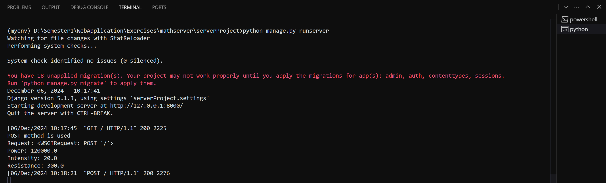
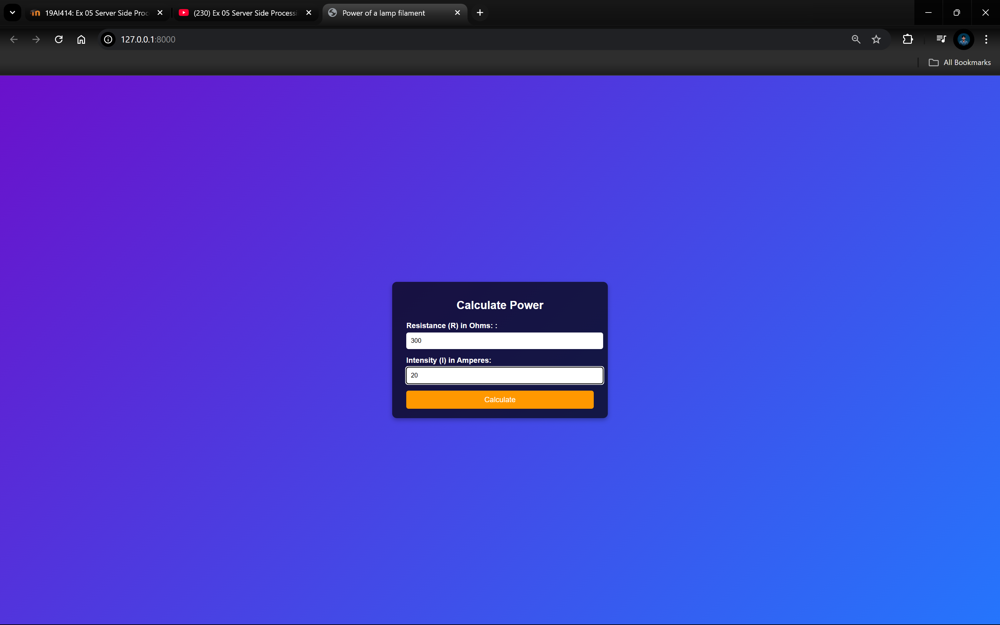
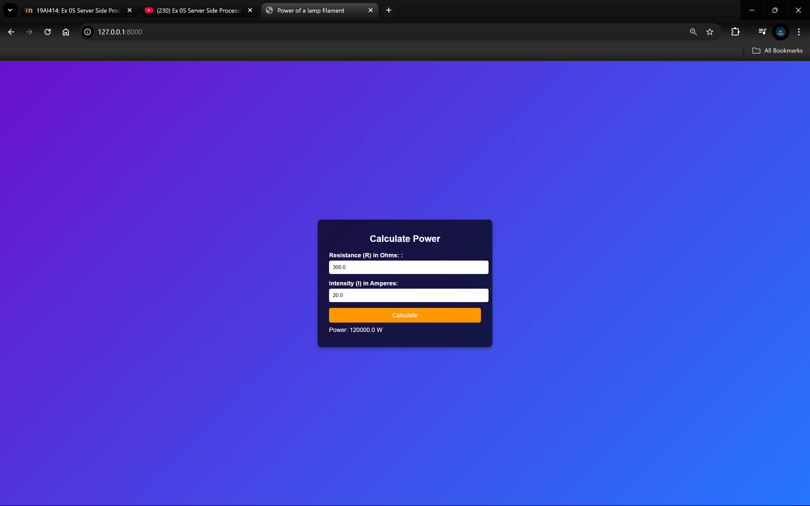

# Ex.05 Design a Website for Server Side Processing
# Date:29 / 11 / 2024
# AIM:
To design a website to calculate the power of a lamp filament in an incandescent bulb in the server side.

# FORMULA:
P = I2R
P --> Power (in watts)
 I --> Intensity
 R --> Resistance

# DESIGN STEPS:
## Step 1:
Clone the repository from GitHub.

## Step 2:
Create Django Admin project.

## Step 3:
Create a New App under the Django Admin project.

## Step 4:
Create python programs for views and urls to perform server side processing.

## Step 5:
Create a HTML file to implement form based input and output.

## Step 6:
Publish the website in the given URL.

# PROGRAM :
## mathServer.html
```html
<!DOCTYPE html>
<html>

<head>
    <title>Power of a lamp filament</title>
    <style>
        body {
            font-family: Arial, sans-serif;
            background: linear-gradient(135deg, #6a11cb, #2575fc);
            color: #fff;
            display: flex;
            justify-content: center;
            align-items: center;
            height: 100vh;
            margin: 0;
        }

        .container {
            background: rgba(0, 0, 0, 0.7);
            padding: 20px 30px;
            border-radius: 10px;
            width: 400px;
            box-shadow: 0 4px 10px rgba(0, 0, 0, 0.3);
        }

        h1 {
            text-align: center;
            margin-bottom: 20px;
            font-size: 24px;
        }

        form {
            display: flex;
            flex-direction: column;
        }

        label {
            margin-bottom: 5px;
            font-weight: bold;
        }

        input[type="text"] {
            padding: 10px;
            margin-bottom: 15px;
            border: none;
            border-radius: 5px;
            width: 100%;
        }

        button {
            padding: 10px;
            border: none;
            border-radius: 5px;
            background: #ff9800;
            color: #fff;
            font-size: 16px;
            cursor: pointer;
            transition: 0.3s ease;
        }

        button:hover {
            background: #e68900;
        }

        p {
            font-size: 16px;
            margin-top: 10px;
        }

        p.error {
            color: #ff4d4d;
        }
    </style>
</head>

<body>
    <div class="container">
        <h1>Calculate Power</h1>
        <form method="POST">
            
            <label for="resistance">Resistance (R) in Ohms: :</label>
            <input type="text" name="resistance" id="resistance" value="{{ resistance }}">

            <label for="intensity">Intensity (I) in Amperes:</label>
            <input type="text" name="intensity" id="intensity" value="{{ intensity }}">

            <button type="submit">Calculate</button>
        </form>

        
        <p>Power: {{ power }} W</p>
        

        
        <p class="error">{{ error }}</p>
        
    </div>
</body>

</html> 
```

## views.py 
```python
from django.shortcuts import render
    
def calculate_values(request):
    context = {
        'power': '',
        'intensity': '',
        'resistance': ''
    }

    if request.method == 'POST':
        print("POST method is used")

        # Get input values from the form
        resistance = request.POST.get('resistance', '0')
        intensity = request.POST.get('intensity', '0')

        print('Request:', request)

        try:
            # Convert inputs to float for calculations
            resistance = float(resistance)
            intensity = float(intensity)

            power = intensity**2*resistance

            # Update the context with calculated values
            context['resistance'] = round(resistance, 2)
            context['power'] = round(power, 2)
            context['intensity'] = round(intensity, 2)

            print('Power:', power)
            print('Intensity:', intensity)
            print('Resistance:', resistance)

        except ValueError:
            # Handle invalid input values
            context['error'] = "Invalid input. Please enter numeric values."

    return render(request, 'serverApp/mathServer.html', context)

```

## urls.py 
```python
from django.contrib import admin
from django.urls import path
from serverApp import views

urlpatterns = [
    path('admin/', admin.site.urls),
    path('',views.calculate_values, name='calculatePowerRoot')
]

```
# SERVER SIDE PROCESSING:

# HOMEPAGE:


# RESULT:
The program for performing server side processing is completed successfully.
